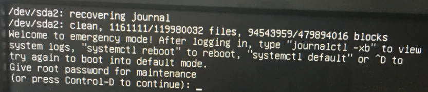

# 故障排查


## 硬盘故障，/dev/sd* recovering journal
开启无法进系统，报错 ```/dev/sdx recovering journal```，如下图：  
 
多半是这块硬盘出问题了，输入root密码登录进去。  
 - 不是系统盘，可以在 ```/etc/fstab``` 下注释掉对应的挂载行。  
 - 是系统盘，考虑使用 ```fstab -y /``` 来尝试修复。  
 - 都不行，尝试关掉自检 ```tune2fs –c 0 –i 0 /dev/sdx``` 在重启。


## ubuntu 进入单用户模式
``` shell
# 1. 重启
reboot

# 2. 等待grub出现，出现后立刻按esc使其停止计时

# 3. 选择ubuntu系统，按e编辑启动参数

# 4. 找到以 linux 开头的行，移动行尾，一般是 quiet splash

# 5. 添加 systemd.unit=rescue.target，统使用 systemd 的紧急救援目标来启动。

# 6. 按 Ctrl + X 来启动系统

# 7. 输入 root 用户的密码进入单用户模式，这是一个最小的 shell 环境。

# 8. 完事后 reboot 重启
```