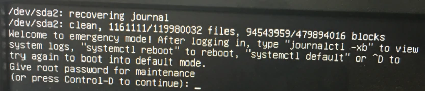

# 运维手册

## 1. swap 管理

### 删除swap

``` shell
# 1. 查看swap
swapon --show
# 2. 关闭swap
swapoff /dev/dm-1
# 3. 删除当前swap
rm -rf /dev/dm-1
# 4. 修改fstab文件，注释掉swap相关行
vim /etc/fstab
#LABEL=YUNIFYSWAP swap                    swap    defaults        0 0
```

### 创建swap

``` shell
# 1. 使用 fallocate 生成一个文件
fallocate -l 32G /swapfile
# 2. 设置权限为 600
chmod 600 /swapfile
# 3. 将文件标记为 swap
mkswap /swapfile
# 4. 开启 swap
swapon /swapfile
# 5. 开机自启动
vim /etc/fstab
/swapfile        none   swap    sw              0       0
# 6. 查看swap
swapon --show
```


## 2. 清理 cache
在 Linux 系统中，内存管理是通过内核自动完成的。内核会将未使用的内存用作缓存（cache）和缓冲区（buffers）以提高系统性能。缓存和缓冲区是用来临时存储数据，以便快速访问。

缓存（Cache）：通常指的是用来存储读取的文件系统数据的内存区域。当文件被读取时，它们的数据会被存储在缓存中，以便下次访问时能更快地读取。
缓冲区（Buffers）：用来存储即将写入磁盘的数据。缓冲区允许操作系统将多个小的写操作合并成较少的大块操作，这样可以减少对磁盘的操作次数，提高效率。

缓存可按照如下命令清理，缓冲区只可以重启清理。
``` shell
sync  # 第一步

# 第二步，三选一
echo 1 > /proc/sys/vm/drop_caches   # 清理页缓存（page cache）
echo 2 > /proc/sys/vm/drop_caches  # 清理目录项和inode缓存
echo 3 > /proc/sys/vm/drop_caches  # 清理页缓存，目录项和inode缓存
```

## 3. 挂载
### 挂载新硬盘，分区 & 格式化
1. 使用parted分区
``` shell
parted /dev/sdx
mklabel gpt
# mkpart 二选一
mkpart primary 1 -1  # 使用所用空间
mkpart primary 2048s 100%  # 4k对齐
print  # 打印分区信息
quit  # 退出parted
```
2. 格式化
``` shell
mkfs.ext4 /dev/sdx1
```
3. mount 
``` shell
mkdir /data  # 必须
mount /dev/sdx1 /data
```
4. 开机自挂载  
 - 直接使用 ```/dev/sdx1``` 挂载（不推荐，硬盘换位置或者掉了系统就启动不了了）。
``` shell 
# 编辑文件 /etc/fstab，追加行
# vim /etc/fstab
/dev/sdb1	/data	ext4	defaults	0	0
# 硬盘分区 挂载点 文件系统 挂载选项 dump fsck
``` 
|硬盘分区|挂载点|文件系统|挂载选项|备份|启动是否检查|
|:-|:-|:-|:-|:-|:-|
|/dev/sdb1|/data|ext4|defaults|0|0|  

 + 挂载选项
    + defaults 表示使用系统默认的挂载选项，通常包括 rw（读写）、suid（允许执行文件的用户ID和组ID设置）、dev（解释字符或块特殊设备）、exec（允许执行二进制程序）、auto（可以被 mount -a 自动挂载）、nouser（只有超级用户可以挂载文件系统）和 async（所有的 I/O 到文件系统应该是异步的）。  
    + nodiratime：不更新目录的访问时间。
    + noatime：不更新文件的访问时间。
    + 可以写成 defaults,noatime,nodiratime，意思是 使用默认选项，并禁用文件和目录的访问时间更新。
 + dump：用于备份程序。0 = 不备份；1 = 备份。这个功能现在很少使用。  
 + fsck 顺序：指定启动时文件系统检查的顺序。0 表示不检查，1 表示首先检查（只有根文件系统 / 设置 1），>= 2 表示多块盘时检查的顺序。  

5. 使用uuid挂载
``` shell 
# 1. 获取UUID
blkid /dev/sdx1
# 2. 挂载
UUID=11234565	/data	ext4	defaults	0	0
# 硬盘分区UUID 挂载点 文件系统 挂载选项 dump fsck
```


### 外置硬盘
``` shell
# 挂载光盘
ls -l /dev | grep cdrom  # 查看当前光盘
mount /dev/cdrom1 /mnt/gp  #  将光盘cdrom1挂载到/mnt/gp下

# 挂载 windows 共享硬盘
mount -t cifs -o username=administrator,password='123' //192.168.1.181/share /share
```

## 4. 虚拟机不重启添加磁盘
``` shell 
for i in `ls /sys/class/scsi_host/*/scan`; do echo "- - -" > $i; done
```

## 5. sudo 权限
给普通用户 sudo 权限，使其当前命令可以以 root 权限来运行。
编辑文件 ```/etc/sudoers```。
``` shell
# 正常情况
ubuntu	ALL=(ALL:ALL) ALL
# sudo 免root密码
ubuntu ALL=(ALL) NOPASSWD:ALL
```

## 6. 网卡配置
### ubuntu16
``` shell
# vim /etc/network/interfices
auto ens33  # 网卡名称，ip add / ifconfig 获得
iface ens33 inet static  # 静态，如果dhcp只配置auto 和iface 2行即可
address 192.168.1.222  # ip
netmask 255.255.255.0  # 子网
gateway 192.168.1.1  # 网关
dns-nameservers 192.168.1.1  # dns，空格分隔配置多个

# 重启网卡

```

### centos7
``` shell
# vim /etc/sysconfig/network-scripts/ifcfg-<enoxxxxx>
DEVICE="eth0"  # 设备名称
BOOTPROTO="static"  # 静态ip
ONBOOT="yes"  # 开机自启
TYPE="Ethernet"  # 网络类型
IPADDR="192.168.1.122"  # IP地址
GATEWAY="192.168.1.1"  # 网关
NETMASK="255.255.255.0"  # 子网掩码
DNS1=192.168.1.1  # dns

# 重启所有
/etc/init.d/netowrk restart

# 重启单个
ifup <网卡>
ifdown <网卡>
```

### ubuntu>20
这个是yaml，一定要注意格式。
``` shell
# vim /etc/netplan/00-installer-config.yaml
network:
  ethernets:
    eno1:  # 网卡
      addresses:
      - 192.168.1.5/24  # IP地址
      gateway4: 192.168.1.254  # 网关
      nameservers:
        addresses:
        - 166.111.8.28  # dns
  version: 2
# 使生效
netplan apply
```

 - 下面是如何配置dhcp
``` shell
network:
  ethernets:
    enp2s0:
      dhcp4: true
  version: 2
```


## 7. 临时修改dns
重启网卡失效！重启失效！重启失效！
``` shell
# vim /etc/resolv.conf
nameserver 114.114.114.114
```

## 8. 防火墙
### centos
``` shell
# 启停
systemctl start firewalld  # 启动
systemctl status firewalld  # 查看状态
systemctl disable firewalld  # 停止
systemctl stop firewalld  # 禁用
firewall-cmd --reload  # 重载防火墙规则

# 配置
firewall-cmd --zone=public --list-ports   查看所有打开的端口
firewall-cmd --get-active-zones           查看区域信息
firewall-cmd --get-zone-of-interface=eth0 查看指定接口所属区域

# 开放/关闭
firewall-cmd --zone=public --list-ports  # 查看所有打开的端口
firewall-cmd --zone=public --query-port=80/tcp  # 查看端口状态

firewall-cmd --zone=public --add-port=8080/tcp --permanent  # 开放端口
firewall-cmd --zone=public --remove-port=80/tcp --permanent  # 关闭端口
  # --permanent 永久生效，没有此参数重启后失效

```

### ubuntu
``` shell
ufw allow 22
ufw allow 22 comment 'Allow SSH connections'  # 带备注
ufw allow proto tcp to 0.0.0.0/0 port 443 comment "this is comment"  # 完整

# 重新加载
ufw enable  # 启用ufw
ufw disable  # 关闭ufw
ufw reload  # 重载参数

# 删除规则
ufw status numbered  # 查看规则的index编号
ufw delete [1]  # 按照编号删除规则
```

## 9. ulimit 相关
ulimit 用于控制用户级别的资源限制

``` shell
# 显示所有的可配置的值
ulimit -a
# 查看单项，例如最大打开文件数量
ulimit -n
# 当前shell生效，调整最大文件打开数量
ulimit -n 102400
```

永久生效需要编辑文件```/etc/security/limits.conf```后重启shell生效。
``` shell
# 设置最大进程数
* soft nproc 102400  # 任何用户可以打开的最大进程数
* hard nproc 102400

# 设置最大文件打开数
* soft nofile 102400  # 任何用户可以打开的最大的文件描述符数量，默认1024，会限制tcp连接
* hard nofile 102400

# soft是一个警告值
# hard是一个真正意义的阀值，超过就会报错
```

注1：* 表示所有用户，@ 代表所有组。  
注2：ubuntu20上，* 不包含root，root需指定root才生效。  
注3：通过 SSH 登录的用户，确保 sshd 守护进程配置中的 UsePAM 设置为 yes，否则不生效。

## 10. 包管理工具
### ubuntu - apt

#### 查看使用apt安装的文件的位置
``` shell
dpkg -L <package>

# eg:
dpkg -L tree
# /.
# /usr
# /usr/bin
# /usr/bin/tree
# /usr/share
# /usr/share/doc
# /usr/share/doc/tree
# /usr/share/doc/tree/README.gz
# /usr/share/doc/tree/TODO
# /usr/share/doc/tree/changelog.Debian.gz
# /usr/share/doc/tree/copyright
# /usr/share/man
# /usr/share/man/man1
# /usr/share/man/man1/tree.1.gz
```

### centos - yum
cengos7 和 8 都无啦，https://blog.centos.org/2023/04/end-dates-are-coming-for-centos-stream-8-and-centos-linux-7/
#### 切换国内源
阿里云源参考地址：https://developer.aliyun.com/mirror/centos/

## 11. 清理多余的内核
``` shell
# 查看当前内核
uname -a

# 查看所有内核
dpkg --get-selections | grep linux

# 移除多余内核，移除之后给所有内核打上已删除标记
apt-get remove a b c d

# 删除"已删除标记"
dpkg --purge `dpkg --get-selections | grep deinstall | cut -f1`
```

## 12. 限制用户登录
``` shell
# 新增参数
/etc/pam.d/sshd
文件里有这一行
session required pam_limits.so

# 增加限制
/etc/security/limits.conf文件末尾增加：
# 所有用户单用户登录：
* - maxlogins 1
# 指定用户单用户登录：
@user - maxlogins 1

# 重启服务器
```

## 13. apt 代理
`vim /etc/apt/apt.conf.d/proxy.conf`  

``` shell
Acquire {
  http::Proxy "http://127.0.0.1:7890/";
  https::Proxy "http://127.0.0.1:7890/";
}
```

## 14. 故障排查

### 硬盘故障，/dev/sd* recovering journal
开启无法进系统，报错 ```/dev/sdx recovering journal```，如下图：  
 
多半是这块硬盘出问题了，输入root密码登录进去。  
 - 不是系统盘，可以在 ```/etc/fstab``` 下注释掉对应的挂载行。  
 - 是系统盘，考虑使用 ```fstab -y /``` 来尝试修复。  
 - 都不行，尝试关掉自检 ```tune2fs –c 0 –i 0 /dev/sdx``` 在重启。


### ubuntu 进入单用户模式
``` shell
# 1. 重启
reboot

# 2. 等待grub出现，出现后立刻按esc使其停止计时

# 3. 选择ubuntu系统，按e编辑启动参数

# 4. 找到以 linux 开头的行，移动行尾，一般是 quiet splash

# 5. 添加 systemd.unit=rescue.target，统使用 systemd 的紧急救援目标来启动。

# 6. 按 Ctrl + X 来启动系统

# 7. 输入 root 用户的密码进入单用户模式，这是一个最小的 shell 环境。

# 8. 完事后 reboot 重启
```

## 15. Systemd 服务配置

### .service 配置文件参数

服务文件分为 `[Unit]`、`[Service]`、`[Install]` 三个区块。

#### [Unit] 区块

| 参数 | 作用 | 示例 |
|------|------|------|
| Description | 服务描述 | `Description=Disk Usage Monitor Service` |
| Documentation | 文档链接 | `Documentation=man:df(1)` |
| After | 在指定单元之后启动 | `After=network.target mysql.service` |
| Before | 在指定单元之前启动 | `Before=nginx.service` |
| Requires | 强依赖，失败则停止当前服务 | `Requires=mysql.service` |
| Wants | 弱依赖，失败不影响当前服务 | `Wants=logrotate.service` |
| Conflicts | 冲突关系，禁止同时运行 | `Conflicts=apache2.service` |

#### [Service] 区块

| 参数 | 作用 | 示例 |
|------|------|------|
| Type | 服务类型 | `simple`/`forking`/`oneshot` |
| ExecStart | 启动命令 | `ExecStart=/usr/bin/myapp` |
| ExecStop | 停止命令 | `ExecStop=/bin/kill $MAINPID` |
| Restart | 重启策略 | `always`/`on-failure`/`no` |
| RestartSec | 重启间隔 | `RestartSec=5` |
| User | 运行用户 | `User=nobody` |
| WorkingDirectory | 工作目录 | `WorkingDirectory=/opt/app` |

#### [Install] 区块

| 参数 | 作用 | 示例 |
|------|------|------|
| WantedBy | 安装到哪个 target | `WantedBy=multi-user.target` |
| RequiredBy | 强依赖此服务 | `RequiredBy=network.target` |

### 常用命令

``` shell
# 重载配置
systemctl daemon-reload

# 启用开机自启
systemctl enable myapp

# 禁用开机自启
systemctl disable myapp

# 查看状态
systemctl status myapp

# 查看日志
journalctl -u myapp
```

## 16. CentOS 7 升级 glibc

> torch > 2.5.1 不再支持旧版 glibc，需升级到 2.28。

### 查看当前版本

``` shell
strings /lib64/libc.so.6 | grep ^GLIBC_
```

### 步骤

#### 1. 切换阿里云源

``` shell
cd /etc/yum.repos.d
rm -rf *
curl -o /etc/yum.repos.d/CentOS-Base.repo https://mirrors.aliyun.com/repo/Centos-7.repo
sed -i -e '/mirrors.cloud.aliyuncs.com/d' -e '/mirrors.aliyuncs.com/d' /etc/yum.repos.d/CentOS-Base.repo
yum clean all && yum makecache
```

#### 2. 安装依赖

``` shell
yum install vim wget texinfo -y
yum groupinstall "Development tools" -y
```

#### 3. 安装 devtoolset-8（gcc 8）

CentOS 官方源已失效，使用阿里云源：

``` shell
cat > /etc/yum.repos.d/CentOS-scl.repo << EOF
[centos-sclo-rh]
name=CentOS-7 - SCLo rh
baseurl=https://mirrors.aliyun.com/centos/7/sclo/x86_64/rh/
gpgcheck=0
enabled=1
EOF

yum clean all && yum makecache
yum install scl-utils scl-utils-build -y
yum install devtoolset-8-gcc devtoolset-8-gcc-c++ devtoolset-8-binutils -y

# 验证
scl enable devtoolset-8 bash
gcc --version
```

#### 4. 升级 make（需要 4.0 - 4.4）

``` shell
wget http://ftp.gnu.org/pub/gnu/make/make-4.3.tar.gz
tar zxvf make-4.3.tar.gz
cd make-4.3
./configure --prefix=/usr/local/make_4_3
make -j$(nproc) && make install

export PATH=/usr/local/make_4_3/bin:$PATH
```

#### 5. 编译 glibc-2.28

``` shell
wget http://ftp.gnu.org/pub/gnu/glibc/glibc-2.28.tar.gz
tar zxvf glibc-2.28.tar.gz
cd glibc-2.28
mkdir build && cd build

scl enable devtoolset-8 bash
MAKE=/usr/local/make_4_3/bin/make ../configure \
  --prefix=/usr/local/glibc_2_28 \
  --with-headers=/usr/include \
  --enable-shared \
  --enable-static \
  --disable-werror \
  --disable-tests \
  --enable-stack-protector=strong

MAKE=/usr/local/make_4_3/bin/make make -j$(nproc) && MAKE=/usr/local/make_4_3/bin/make make install
```

### 常见问题

#### 重启后 locale 警告

```
-bash: warning: setlocale: LC_TIME: cannot change locale (en_US.UTF-8)
```

解决：
``` shell
localedef -i en_US -f UTF-8 en_US.UTF-8
```

### 注意事项

- glibc 是核心库，升级可能导致系统不稳定
- 建议使用容器或虚拟机运行需要新版 glibc 的应用
- 可通过 `patchelf` 修改应用的 RPATH 使用独立安装的 glibc

## 17. CentOS 7 升级 gcc

升级需谨慎。  
必须按照顺序一个一个编译。  
1. 安装gmp  
下载地址：https://gmplib.org/download/gmp/  

``` shell
./configure --prefix=/usr/local/gmp
make -j$(nproc) && make install
```

2. 安装MPFR  
下载地址：https://www.mpfr.org/mpfr-current  

``` shell
./configure --prefix=/usr/local/mpfr --with-gmp=/usr/local/gmp
make -j$(nproc) && make install
```

3. 安装mpc  
下载地址：ftp://ftp.gnu.org/gnu/mpc/  

``` shell
./configure --prefix=/usr/local/mpc --with-gmp=/usr/local/gmp --with-mpfr=/usr/local/mpfr
make -j$(nproc) && make install
```

4. 安装gcc  
下载地址：ftp://ftp.gnu.org/gnu/gcc/  

``` shell
export LD_LIBRARY_PATH=/usr/local/mpc/lib:/usr/local/gmp/lib:/usr/local/mpfr/lib:$LD_LIBRARY_PATH
./configure --prefix=/usr/local/gcc --enable-threads=posix --disable-checking --disable-multilib --enable-languages=c,c++ --with-gmp=/usr/local/gmp --with-mpfr=/usr/local/mpfr --with-mpc=/usr/local/mpc
make -j$(nproc)&& make install
```

5. 制作软链接  

``` shell
ln -sf /usr/local/gcc/bin/gcc /usr/bin/gcc
ln -sf /usr/local/gcc/bin/c++ /usr/bin/c++
ln -sf /usr/local/gcc/bin/g++ /usr/bin/g++
ln -sf /usr/local/gcc/lib64/libstdc++.so.6.0.xx /usr/lib64/libstdc++.so.6
```

6. 查看glibc版本
``` shell
strings /usr/lib64/libstdc++.so.6 | grep "GLIBC"
```
